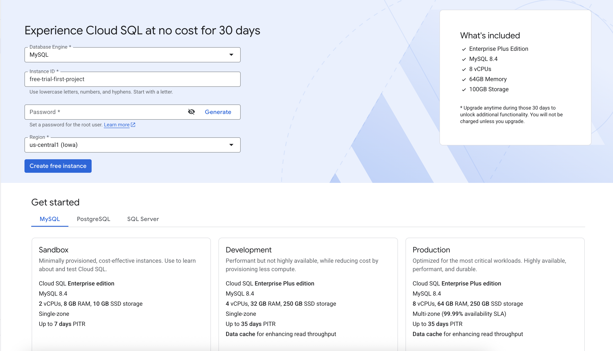
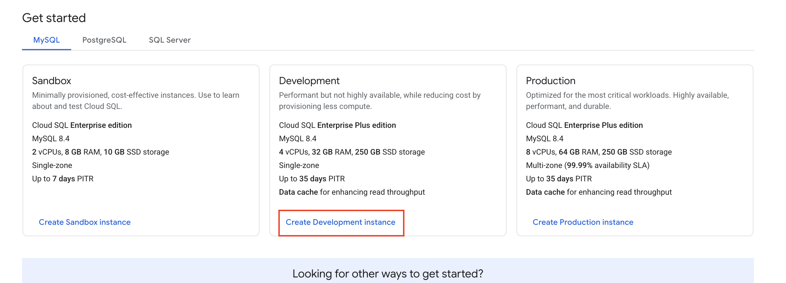
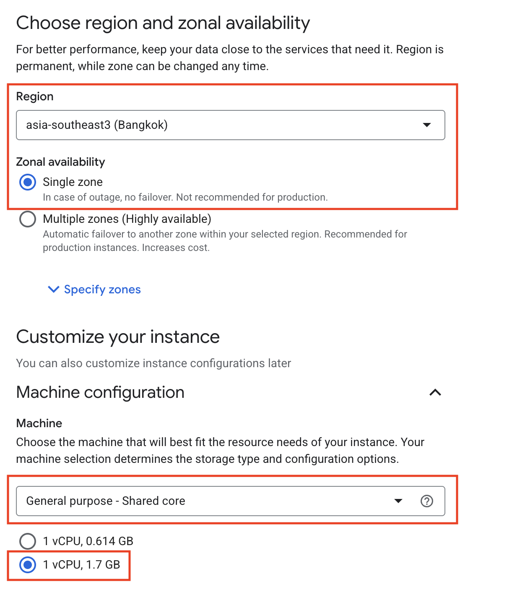
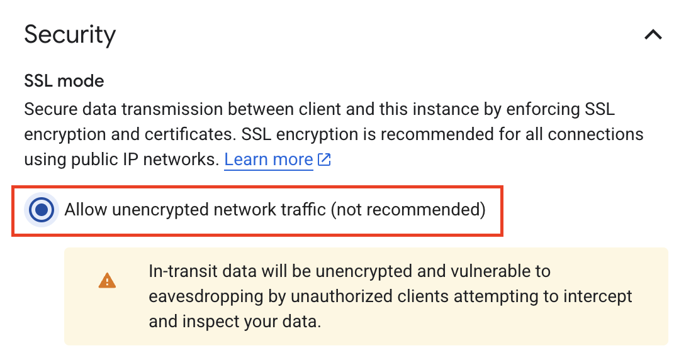

# Module 01: Setup Cloud SQL

In this module, since the Google Cloud Console for Cloud SQL has been updated, especially for first-time setup, the instructions will look slightly different from the original workshop guide.

## Creating a new Cloud SQL Instance

When you navigate to the Cloud SQL page for the first time, you will encounter a new landing page.

1.  **Select Instance Type**: On the homepage, scroll down to find the **Choose an instance** section and select the **Development** instance type.
    
    

2.  **General Configuration**:
    - **Database Engine**: Follow the original workshop guide to choose **MySQL 5.7**.
    - **Authentication**: Set your **Instance ID** and **root password** as instructed.

3.  **Region and Machine Type**:
    - **Region**: Choose **asia-southeast3 (Bangkok)**.
    - **Zonal availability**: You can leave this as Single zone for the workshop.
    - **Machine configuration**: Choose **Shared Core** machine type with **1 vCPU and 1.7 GB** (General Purpose).
      

4.  **Security**:
    - In the configuration sections, look for **Security**.
    - Ensure you check **"Allow Unencrypted Network Traffic"** to allow the application to connect during the workshop.
      

Once configured, click **Create Instance** and proceed with the database schema and data initialization as guided in the workshop.
