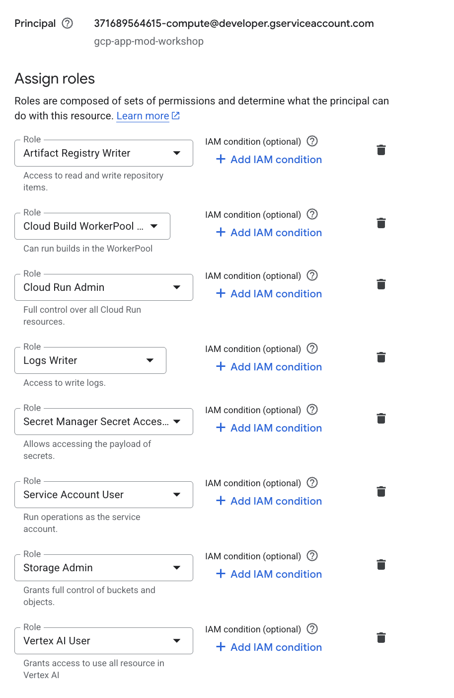

# Module 03: Cloud Run Deployment

In this module, when you first attempt to run `gcloud run deploy`, you may encounter **insufficient permission** issues. This is often because the default Compute Engine service account lacks the necessary roles to perform the deployment and access required services.

## Granting Required Permissions

To ensure the workshop runs smoothly, you need to add specific roles to your default compute service account.

1.  Navigate to **IAM & Admin > Service Accounts** in the Google Cloud Console.
2.  Locate the default compute service account, which usually follows the pattern: `xxxxxxxxxxxx-compute@developer.gserviceaccount.com`.
3.  Add the following roles to this service account:
    - **Storage Admin**: For accessing Cloud Storage buckets.
    - **Logs Writer**: For writing application logs.
    - **Artifact Registry Writer**: For pushing container images.
    - **Secret Manager Secret Accessor**: For accessing secrets.
    - **Cloud Run Admin**: For managing Cloud Run services.
    - **Service Account User**: To allow the service account to act as itself.
    - **Vertex AI User**: For AI-related features.
    - **Cloud Build WorkerPool User**: For build operations.

Once these roles are granted, you should be able to proceed with the `gcloud run deploy` command without permission errors.
