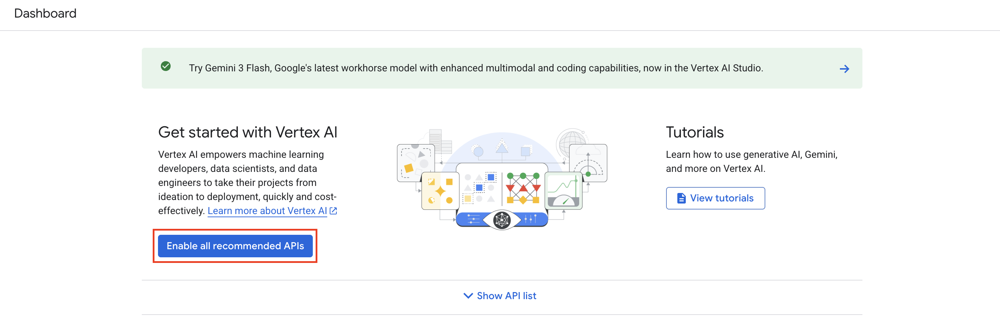

# Module 07: Cloud Run Functions & AI Integration

In this module, we will explore the integration of Cloud Run Functions with Vertex AI for automated image description.

## Cloud Run Functions UI Update

The Google Cloud Console has recently revamped the Cloud Functions interface. It is now more closely integrated with Cloud Run. When you navigate to the Cloud Functions page, you may notice it redirects or looks identical to the Cloud Run interface, as Cloud Run Functions are now a subset of Cloud Run's capabilities.

## Solution Code

For the updated solution using Vertex AI and the Gemini model, please refer to the implementation in:

- [gcf/main.py](../../gcf/main.py)

## Model Selection

For this workshop, we recommend using the **`gemini-2.5-flash`** model. This is already configured in the provided solution code.

## Vertex AI API Configuration

If you encounter any permission issues or errors related to Vertex AI while deploying or running your function:

1.  Navigate to the **Vertex AI Dashboard** in the Google Cloud Console: [https://console.cloud.google.com/vertex-ai/dashboard](https://console.cloud.google.com/vertex-ai/dashboard)
2.  Click on the **"Enable all recommended APIs"** button to ensure all necessary services for Gemini and Vertex AI are active.

_Note: Ensure you have the `Vertex AI User` role granted to your service account as discussed in [Module 03](./module-03.md)._
